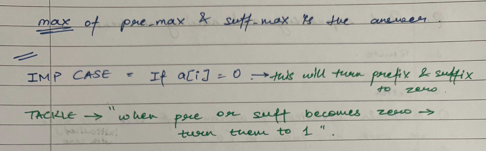

Given an integer array nums, find a subarray that has the largest product, and return the product.

The test cases are generated so that the answer will fit in a 32-bit integer.

 
Example 1:

Input: nums = [2,3,-2,4]
Output: 6
Explanation: [2,3] has the largest product 6.
Example 2:

Input: nums = [-2,0,-1]
Output: 0
Explanation: The result cannot be 2, because [-2,-1] is not a subarray.

****************

class Solution {
public:
    int maxProduct(vector<int>& nums) {
        
    }
};


## Intuition

- this is a little different because now we are NOT limited to just comparisons -->> BUT WE WILL NEED TO TAKE THE COMPLETE SUBARRAY INTO CONSIDERATION
- this has arised bcoz we are working with product - will also arise for max sum subarray


## BRUTE FORCE - triple loop
1. loop 1 for left bound of array under consideration
2. loop 2 for right bound of array under consideration
3. loop 3 for going between left & right bound of array to calculate product

```
class Solution {
public:
    int maxProduct(vector<int>& nums) {

        int maxP = INT_MIN;
        int n = nums.size();

        for (int i = 0; i < n; i++){
            
            for (int j = i; j < n; j++){
                
                int local_product = 1;

                for (int k = i; k <= j; k++){

                    local_product *= nums[k];
                    
                }

                maxP = max(maxP, local_product);
                
            }
        }
        return maxP;
    }
};
```


## BETTER Approach  --> Running Product

- we can notice that we are calculating the products of the same numbers AGAIN AND AGAIN
- so instead of initializing the product for very subarray in 3rd loop --> we initialize it for 2nd loop
- using this --> "INCREASING RIGHT BOUND OF ARRAY UNDER CONSIDERATION" is treated as iterating over the array itself --> i.e "j" is now increasing range of current subarray and also giving us the new element to be multiplied in the subarray

**-->> by doing this we are bringing our O(n^3) solution to O(n^2)**


```
class Solution {
public:
    int maxProduct(vector<int>& nums) {

        int maxP = INT_MIN;
        int n = nums.size();

        for (int i = 0; i < n; i++){

            int current_product = 1;
            
            for (int j = i; j < n; j++){

                current_product *= nums[j];

                maxP = max(maxP, current_product);
                
            }
        }

        return maxP;
    }
};
```


## OPTIMAL Approach  --> Prefix / Suffix Product





```
class Solution {
public:
    int maxProduct(vector<int>& nums) {

        int n = nums.size();
        int prefix_product = 1;
        int suffix_product = 1;

        int GLOBAL_MAX_PROD = INT_MIN;

        for (int i = 0; i < n; i ++){

            if (prefix_product == 0) prefix_product = 1;
            if (suffix_product == 0) suffix_product = 1;

            prefix_product = prefix_product * nums[i];
            suffix_product = suffix_product * nums[n - 1 - i];

            // at that given time, the max will be the max of both splits/sub-arrays/prefix&suffix --> which will be compared to THE GLOBAL MAX to keep a track of the answer

            GLOBAL_MAX_PROD = max (GLOBAL_MAX_PROD, max (prefix_product, suffix_product ));

        }

        return GLOBAL_MAX_PROD;
    }
};
```


