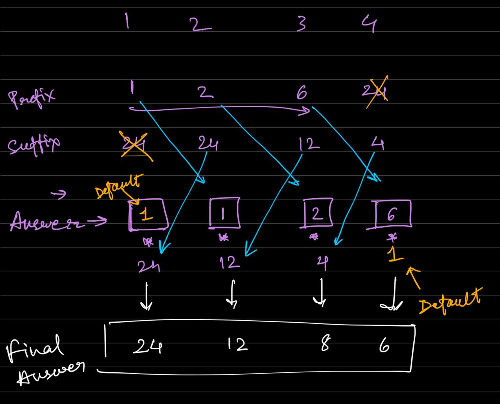

Given an integer array nums, return an array answer such that answer[i] is equal to the product of all the elements of nums except nums[i].

The product of any prefix or suffix of nums is guaranteed to fit in a 32-bit integer.

You must write an algorithm that runs in O(n) time and without using the division operation.

 

Example 1:

Input: nums = [1,2,3,4]
Output: [24,12,8,6]
Example 2:

Input: nums = [-1,1,0,-3,3]
Output: [0,0,9,0,0]


****************


## Intuition

- we basically are splitting the array in 2 different arrays at every point
- we need to calculate product of bot and then multiply them together


## BRUTE FORCE --> for every element (i), multiple all the other elements --> O(n^2)

```
class Solution {
public:
    vector<int> productExceptSelf(vector<int>& nums) {

        int n = nums.size();
        vector <int> answer(n, INT_MIN);

        for (int i = 0; i < n; i++){

            int prod = 1;
            for (int j = 0; j < n; j++){
                if (j == i){continue;}

                prod *= nums[j];
            }

            answer[i] = prod;
        }

        return answer;
    }
};
```


## BETTER --> Divide the array Product NOT ALLOWED BUT STILL A SOLUTION if a different variation


## Intuition

- this does not work with zeroes - not only due to divide by zero problem 
- 2 main issues:
    - array product gets corrupted and becomes zero
    - traversing and replacing zeroes in answer array can also not work because we dont know WHERE are the zeroes


**SOLUTION INTUITION --> if there are more than 1 zeroes then the answer array is full of zeroes**

```
class Solution {
public:
    vector<int> productExceptSelf(vector<int>& nums) {

        int n = nums.size();

        vector <int> answer (n, 0);


        //Make the FIRST Traversal across array 
        // 1. Total Product by ignoring zeroes
        // 2. Zero Count 
        // 3. Zero Position

        int total_product = 1;
        int zero_counter = 0;
        int zero_posi = -1;

        for (int i = 0; i < n; i++){


            if (nums[i] == 0){
                if (zero_counter == 0){
                    zero_counter++;
                    zero_posi = i;
                    
                    continue; // we dont want this in the product
                }
                else{
                    return answer;
                }
            }      

            total_product *= nums[i];
  
        }


        // If there is one zero in the 

        if (zero_counter > 0){
            answer[zero_posi] = total_product;
            return answer;
        }

        // If there is no zero

        else{

            for (int i = 0; i < n; i++){
                answer[i] = total_product / nums[i];
            }
        }
        

        return answer;
        
    }
};
```


# ACTUAL SOLUTION --> Prefix Suffix IN 2 DIFFERENT PASSES 





- in first pass, write the prefix prods in the answer array AT CORRECT POSITIONS 
    - for ith element we write prefix in (i+1)th position in answer array 
    - this also means that the prefix for nth element does not get registered
    - **DEFAULT prefix for i = 0 --> 1**

- in second pass --> we update the answer array by multiplying the values by the suffix products
    - **STARTING FROM END** --> for ith element we multiply suffix in (i-1)th position in the answer array 
    - this also means that the suffix for first element does not get registered
    - **DEFAULT suffix for i = (n-1) --> 1**


```
class Solution {
public:
    vector<int> productExceptSelf(vector<int>& nums) {

        int n = nums.size();
        vector <int> answer (n, 1); // CHOSE 1 because our default values are 1 in first and second passes

        // first pass

        int prefix_prod = 1;
        for (int i = 0; i < n - 1; i++){

            prefix_prod *= nums[i];
            answer [i+1] = prefix_prod; 

        }


        // second pass

        int suffix_prod = 1;
        for (int i = n - 1; i > 0; i--){
            suffix_prod *= nums[i];
            answer [i-1] *= suffix_prod; 
        }

        return answer;

        
    }
};
```


